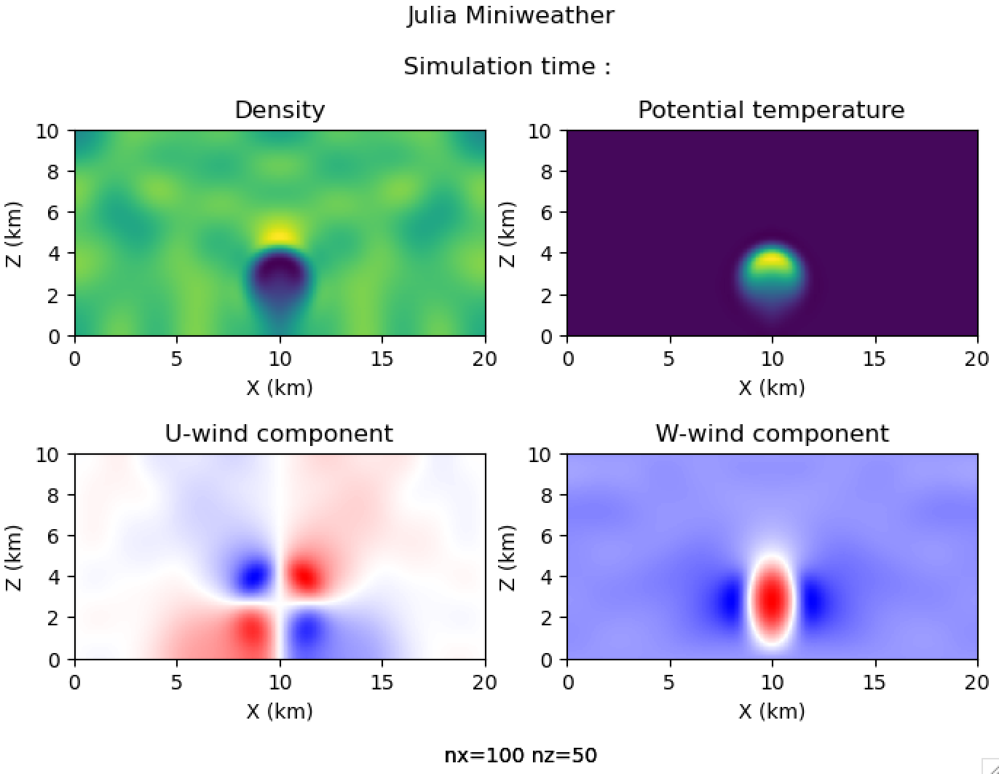

.. _builtin-apps:

=================================
FortLab Built-in Apps
=================================

Fortlab is consist of multiple applications that can be assembled together to generate a kernel-based software tools. As of this version, there are following apps in Fortlab.

* compileroption  : compiles the target application and collect compiler options per each compiled source files.
* timinggen       : generates the elapsed time of the specified kernel region in JSON file, per every MPI ranks, every OpenMP threads(if any), and every invocation of the code regions
* resolve         : generates cross-referece information of all Fortran names used in the specified kernel region directly as well as indirectly.
* kernelgen       : generates the kernel source files and data files to drive the extracted kernel.
* vargen          : generates source files that contains the cross-referece information of all Fortran names used in the specified kernel region

To explain Fortlab apps, we will use miniWeather fortran application.  miniWeather is an accelerant app mainly developed by `Dr. Matthew Norman <https://mrnorman.github.io>`_. miniWeather simulates weather-like flows for training in parallelizing accelerated HPC architectures. Please see `here <https://github.com/mrnorman/miniWeather/blob/main/fortran/miniWeather_mpi.F90>`_ for the source code of miniWeather Fortran MPI version that is used in this examples.

You can find all the commands used in the following examples in `Fortlab Github repository <https://github.com/grnydawn/fortlab/tree/master/examples/miniWeather>`_.

.. toctree::
    :maxdepth: 2

    compileroption
    timinggen
    resolve
    kernelgen
    vargen
