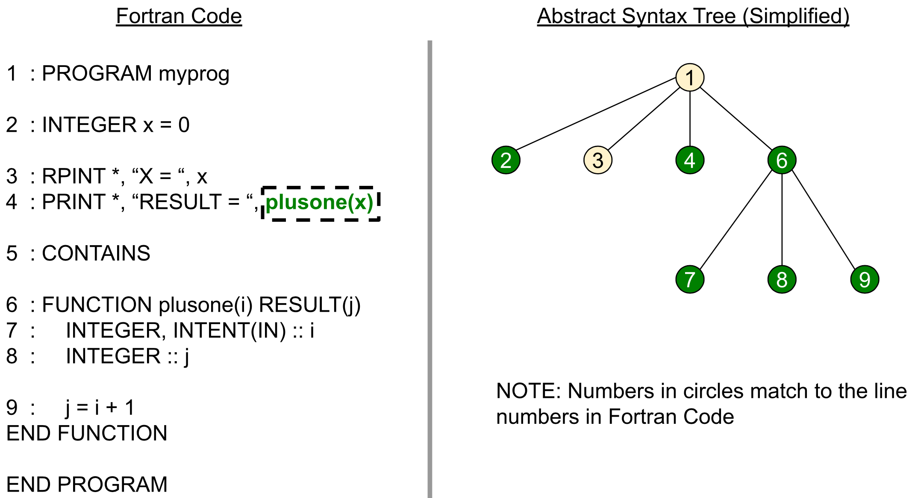

.. _resolve-app:

*********************
resolve app
*********************

To decide which Fortran statements should be copied in the generated kernel code, all of Fortran name references should be resolved correctly. For example, if a variable is used in a statement, the definition of the variable should be copied in the generated kernel too even the name is defined in another source file or Fortran module. This name-reference analysis is statically done using Abstract Syntax Tree("AST") generated from a Fortran parser, F2PY.

Assuming that we want to extract "plusone(x)" at line 4 in Figure 2, the analyzer constructs AST of the entire Fortran code and decides that the dark nodes should be copied in the generated kernel. The resolution process starts with collect- ing names to be extracted. In this example of Figure 2, the resolver collects "plusone" and "x" in circle number 4. Next, the resolver moves one level up in the AST to PROGRAM statement, which is the circle number 1, and decides that circle number 2 and 6 are required. Because FUNCTION at the circle 6 includes all of circles 7,8, and 9, the three nodes under the circle 6 are also copied.

Example
***********

Usage
***********

usage: fortlab-resolve [-h] [--version] [--import-source srcpath] [--compile-info path] [--keep analysis]
                               [-i INCLUDE_INI] [-e EXCLUDE_INI] [-I INCLUDE] [-D MACRO] [--outdir OUTDIR]
                               [--source SOURCE] [--intrinsic INTRINSIC] [--machinefile MACHINEFILE] [--debug DEBUG]
                               [--logging LOGGING] [--invocation INVOCATION] [--data DATA] [--openmp OPENMP] [--mpi MPI]
                               [--timing TIMING] [--prerun PRERUN] [--rebuild REBUILD] [--state-switch STATE_SWITCH]
                               [--kernel-option KERNEL_OPTION] [--check CHECK] [--verbose VERBOSE_LEVEL]
                               [--add-mpi-frame ADD_MPI_FRAME] [--add-cache-pollution ADD_CACHE_POLLUTION]
                               [--repr-etime REPR_ETIME] [--repr-papi REPR_PAPI] [--repr-code REPR_CODE]
                               path

        positional arguments:
          path                  callsite file path

        optional arguments:
          -h, --help            show this help message and exit
          --version             show program's version number and exit
          --import-source srcpath
                                load source file
          --compile-info path   compiler flags
          --keep analysis       keep analysis
          -i INCLUDE_INI, --include-ini INCLUDE_INI
                                information used for analysis
          -e EXCLUDE_INI, --exclude-ini EXCLUDE_INI
                                information excluded for analysis
          -I INCLUDE            include path information used for analysis
          -D MACRO              macro information used for analysis
          --outdir OUTDIR       path to create outputs
          --source SOURCE       Setting source file related properties
          --intrinsic INTRINSIC
                                Specifying resolution for intrinsic procedures during searching
          --machinefile MACHINEFILE
                                Specifying machinefile
          --debug DEBUG
          --logging LOGGING
          --invocation INVOCATION
                                (process, thread, invocation) pairs of kernel for data collection
          --data DATA           Control state data generation
          --openmp OPENMP       Specifying OpenMP options
          --mpi MPI             MPI information for data collection
          --timing TIMING       Timing measurement information
          --prerun PRERUN       prerun commands
          --rebuild REBUILD     rebuild controls
          --state-switch STATE_SWITCH
                                Specifying how to switch orignal sources with instrumented ones.
          --kernel-option KERNEL_OPTION
                                Specifying kernel compiler and linker options
          --check CHECK         Kernel correctness check information
          --verbose VERBOSE_LEVEL
                                Set the verbose level for verification output
          --add-mpi-frame ADD_MPI_FRAME
                                Add MPI frame codes in kernel_driver
          --add-cache-pollution ADD_CACHE_POLLUTION
                                Add cache pollution frame codes in kernel_driver
          --repr-etime REPR_ETIME
                                Specifying elapsedtime representativeness feature flags
          --repr-papi REPR_PAPI
                                Specifying papi counter representativeness feature flags
          --repr-code REPR_CODE
                                Specifying code coverage representativeness feature flags

        This app may feed-forward following data to next app:
          analysis (type=any)        analysis object
